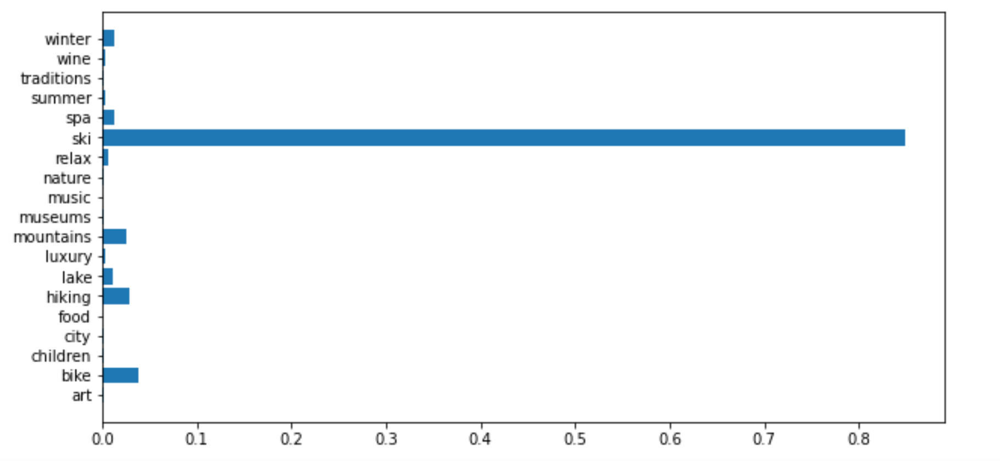

# Recommender System

## How to set-up the code

#### 1. Clone the repository
Open the command line, go in a directory of your choice, and run:
```bash
$ git clone https://git.unic.com/scm/aismtcu/recommender_system.git
```

#### 2. Create virtual Python environment
You need to have [Python3](https://www.python.org/) first. Follow the instruction corresponding to your operating system.

Install the ```venv.recommender```(any name you like) environment using venv (only for python3)
```bash
$ python3 -m venv your_place/venv.recommender
```
If you encounter a problem, follow the instruction in the error message. You may need to install the `python3-dev` package. Now you can activate the environment
```bash
$ source your_place/venv.scrapy/bin/activate
```
#### 3. Install required packages
Install packages from `requirements.txt` in the *activated* environment

```bash
(venv.recommender)$ cd recommender_system # go to the same folder as requirement.txt
(venv.recommender)$ pip install -r requirements.txt
```
#### 4. Deactivate virtual environment
The virtual environment can be deactivated at any time with

```bash
(venv.recommender)$ deactivate

```
#### 5. Run the app
```bash
(venv.recommender)$ cd recommender_system/ # stay in the same folder as scrapy.cfg
(venv.recommender)$ streamlit run app.py
```

This should open your favourite browser and launch the app on your local host 8501. <br>
Look at the image below to see how the page should look like.


## How to Use The App

#### 1. Choose the topics
Under the question 'What kind of vacation are you looking for?' you can choose different topics for your vacation style.
The ones available at the moment are:
```python
topics = ['city', 'children', 'museums', 'art', 'music', 
          'traditions', 'luxury', 'nature', 'mountains',
          'relax', 'lake', 'wine', 'food', 'bike', 'ski', 
          'hiking', 'spa', 'summer', 'winter']
```
Look at the tutorial below on the **Change General Settings** section to see how to change the list of possible topics.
#### 2. Choose number of activities and distance
By using the 2 sliders you can choose the maximum number of activities that you want to do in a day, and the maximum
distance in kilometers between activities.

#### 3. Press Done
After you have chosen the topics, the number of activities and the distance and you have pressed **Done**, your page should
look something like this:


* The combinations of activities recommended are sorted by _Similarity Score_.
* For each combination of activities you can see the titles of the activities. Clicking on the title it will expand
showing you a description of the activity.
* Every combination of activities has a colour (the colour of the big circle before the Similarity Score). 
In the map at the end of the page you can find the activities looking at their colours.
* The map is interactive, you can zoom in and out.

#### 4. Choose the combinations of activities that you like the most
Once you have read all the combinations of activities, you can select the ones that you've liked the most by checking
the small boxes on the left side, like this:


#### 5. Update the User preferences
After checking your preferences, you can update the recommender system, so that it gives you better results, depending
on the combinations that you have chosen.

To do so, click on the button **Done** at the end of the page. At this point a button **Update** should appear. Click
on it and the recommendations should refresh and get more accurate.

#### 6. Visualize the User preferences
If you want to get an idea of how the system is tracking the user preferences, you can check on the box **show user vector**
under the slider to choose the maximum distance. A sidebar on the left side should appear:


Check the box again to make the sidebar disappear.

#### 7. Change some of the initial settings
To change some initial settings, such as topics, number of activities and distance, you can click on the button
**Clear**, and afterwards you can change the settings, as you did on the points 1. and 2. When you are done you simply
click on the button **Done** as you did on the point 3.


## Change General Settings
### Change the topics list
Open the initialize.py file and change the topics list, then run:
```bash
(venv.recommender)$ python initialize.py
```
The topics in this list have been taken from the MySwitzerland.com 
website newsletter and have been integrated with topics generated by the clustering method that you can find in the file
_recommender/Clustering.py_

### Change the NLP model used
The NLP model that has been currently used to generate the words embedding is the "word2vec-google-news-300" that you can 
download using the gensim.downloader.
You can find many other models in the gensim.downloader documentation. <br>
To change this run:
```bash
(venv.recommender)$ python initialize.py --model_name THE_MODEL_YOU_LIKE_THE_MOST
```

## How To Use the Code
For a demo on how to use all the different classes that you can find into the folder _recommender_ look at the
_Notebook.ipynb_ that you can use as a playground to experiment with the code. <br>
This operation is done by the _DataLoader_.

## General Theoretical Overview
### Text Pre-Processing
Before being able to use the articles (that are saved into the _data/data.csv_ file) for our recommender system, we need 
to preprocess the text into the articles. In particular, we remove from the articles all the stop_words (words that do 
not add meaning to the text, such as "and", "or", "then", "therefore", etc.) and words that are misspelled, and we
tokenize the article. This gives us a vector of words for each article.

### Word embedding
The word embedding is a technique that allows the representation of the words as real valued vectors, 
such that the words that are closer in the vector space are expected to be similar in meaning and context.
For more information on the topic check the [Wikipedia page](https://en.wikipedia.org/wiki/Word_embedding).

In our case, we used the _word2vec_ model for word embedding.

### Clustering method for topics generation
A clustering method (KMeans, find more information about how it works [here](https://de.wikipedia.org/wiki/K-Means-Algorithmus))
has been used to cluster the words from all the articles to detect which are the predominant topics in the articles. <br>
The class _Clustering_ that has been used to perform the clustering is in the 
file _recommender/Clustering.py_.

### Topics-based vector representation of the articles
Once we generated the topics with the clustering, eliminated the non-relevant ones, and integrated them with topics from the
MySwitzerland.com newsletter, we can generate a vector representation of the articles based on how similar they are to the
given topic. <br>
To generate the topics-based vector representation for an article, we follow the following steps:
1. we get the word embedding vector of all the words in the preprocessed article;
2. we get the word embedding vector of all the topics in the topics list;
3. for each topic we compute the sum of the distances between the topic vector and all the word vectors in the article;
4. at this point, given an article, for every topic we have a score. We normalize these scores with respect
to the sum of the scores, so that for each article their topics-based vector representation is a 1-norm vector.
   
Example:
```
Learn to ski in the place where the world's top ski athletes compete: on Corviglia above St. Moritz. Your first ski lesson is rewarde with a carriage ride to the slope and back.
```


In which proportion the article can be categorized as part of the different topics.

### Topics-based vector representation of the user
As we did for the articles, we can get a topics-based vector representation of the user. In the first place this vector 
representation is obtained by asking explicitly to the user which topics they prefer from the list of topics. Then, we 
assign to the user a 1-norm vector, such that if they have chosen n topics, the weights of the chosen topics will be 
1/n, and the weights of the topics that has not been chosen will be zero.<br>
This vector should virtually represent in which proportion the user likes the different topics.


### User Update
We can learn what kind of articles the user likes, thus providing recommendations that are more and more accurate. 
To do so, we need to update the topics-based vector representation of the user, that keeps track of the preferences of
the user for the different articles. <br>
In particular, if we know that the user likes a certain article, we can update the vector-based representation of the user
by taking a weighted mean between the current vector representation of the user, and the vector representation of the article 
that they like.


### Recommendations based on the user
Since the topics-based vector representation of the user indicates its preferences with respect to the topics, and the topics-based
representation of the articles indicates how much an article is about each of the topics, we will recommend to the user 
the articles that are as close as possible in the euclidean distance with respect to the user in the topics-based vector space.


### Recommendations of combinations of articles, based on the user and the position
To generate better results for the user, we can suggest combinations of articles, instead of single articles (remember 
that each article represent an activity that the user can do, so combining many articles, means combining many activities
that the user can do perhaps during a vacation). This is particularly relevant when the topics that the user choose
are varied, and there is not a single activity that can cover them all. An example could be if the user is looking
for 'Ski' and 'Spa'. <br>
However, would be very unpractical if the user would be recommended to do a combination of activities that are very far within
each others, or a combination with a number of activities that are more than the ones that they can actually do. For this
reason, we allow the user to specify the maximum number of activities that they want to do, and the maximum distance 
between activities.

To generate Recommendations of combinations of articles, based on the user and the position we follow these steps:
1. generate the recommendations based on the user as explained above. Take only the first n best recommendations;
2. generate all the possible combinations of the articles, such as in a combination there is a number of articles that is
lower than the maximum number of activities decided by the user, and the positions of the activities described by the 
articles is lower than the maximum distance decided by the user;
3. take the mean of the vector based representation of the articles within a combination to get the vector based representation
of the combination. Check which combinations are as close as possible in the euclidean distance to the user in the topics-based
vector space.
   


