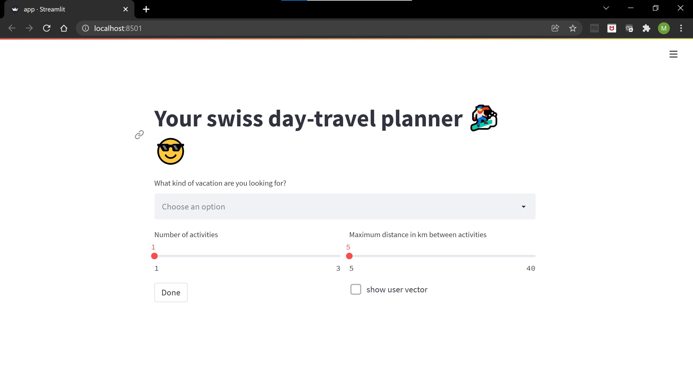
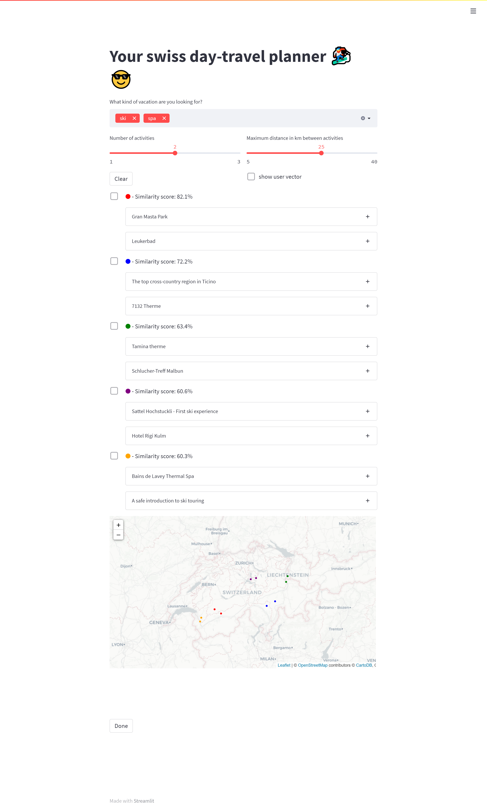
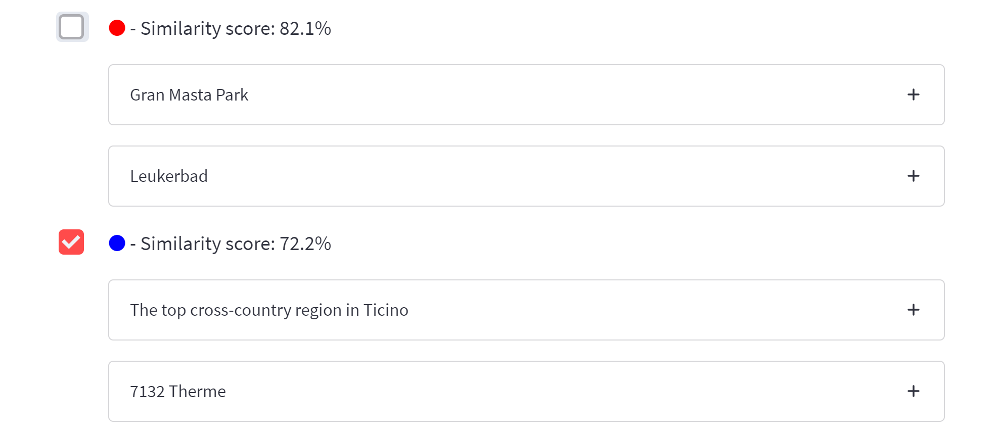
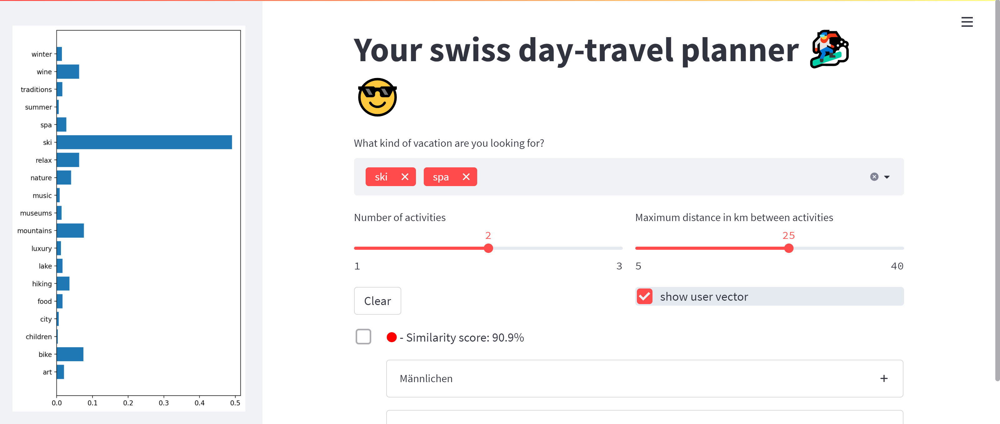

# Recommender System

## How to set-up the code

### Clone the repository
Open the command line, go in a directory of your choice, and run:
```bash
$ git clone https://git.unic.com/scm/aismtcu/recommender_system.git
```

### Create virtual Python environment
You need to have [Python3](https://www.python.org/) first. Follow the instruction corresponding to your operating system.

#### Install the ```venv.recommender```(any name you like) environment using venv (only for python3)
```bash
$ python3 -m venv your_place/venv.recommender
```
If you encounter a problem, follow the instruction in the error message. You may need to install the `python3-dev` package. Now you can activate the environment
```bash
$ source your_place/venv.scrapy/bin/activate
```
#### Install required packages
Install packages from `requirements.txt` in the *activated* environment

```bash
(venv.recommender)$ cd recommender_system # go to the same folder as requirement.txt
(venv.recommender)$ pip install -r requirements.txt
```
#### Deactivate virtual environment
The virtual environment can be deactivated at any time with

```bash
(venv.recommender)$ deactivate
```

## How to Use The App
### Run the app
```bash
(venv.recommender)$ cd recommender_system/ # stay in the same folder as scrapy.cfg
(venv.recommender)$ streamlit run app.py
```

This should open your favourite browser and launch the app on your local host 8501. <br>
Look at the image below to see how the page should look like.


### Use the app
#### 1. Choose the topics
Under the question 'What kind of vacation are you looking for?' you can choose different topics for your vacation style.
The ones available at the moment are:
```python
topics = ['city', 'children', 'museums', 'art', 'music', 
          'traditions', 'luxury', 'nature', 'mountains',
          'relax', 'lake', 'wine', 'food', 'bike', 'ski', 
          'hiking', 'spa', 'summer', 'winter']
```
Look at the tutorial below on the **Change General Settings** section to see how to change the list of possible topics.
#### 2. Choose number of activities and distance
By using the 2 sliders you can choose the maximum number of activities that you want to do in a day, and the maximum
distance in kilometers between activities.

#### 3. Press Done
After you have chosen the topics, the number of activities and the distance and you have pressed **Done**, your page should
look something like this:


* The combinations of activities recommended are sorted by _Similarity Score_.
* For each combination of activities you can see the titles of the activities. Clicking on the title it will expand
showing you a description of the activity.
* Every combination of activities has a colour (the big circle before the Similarity Score). 
In the map at the end of the page you can find the activities looking at their colours.
* The map is interactive, you can zoom in and out.

#### 4. Choose the combinations of activities that you like the most
Once you have read all the combinations of activities, you can select the ones that you've liked the most by checking
the small boxes on the left side, like this:


#### 5. Update the User preferences
After checking your preferences, you can update the recommender system, so that it gives you better results, depending
on the combinations that you have chosen.

To do so, click on the button **Done** at the end of the page. At this point a button **Update** should appear. Click
on it and the recommendations should refresh and get more accurate.

#### 6. Visualize the User preferences
If you want to get an idea of how the system is tracking the user preferences, you can check on the box **show user vector**
under the slider to choose the maximum distance. A sidebar on the left side should appear:



Check the box again to make the sidebar disappear.

#### 7. Change some of the initial settings
To change some initial settings, such as topics, number of activities and distance, you can click on the button
**Clear**, and afterwards you can change the settings, as you did on the points 1. and 2. When you are done you simply
click on the button **Done** as you did on the point 3.


## Change General Settings
### Change the topics list
Open the initialize.py file and change the topics list, then run:
```bash
(venv.recommender)$ python initialize.py
```
The topics in this list have been taken from the MySwitzerland.com 
website newsletter and have been integrated with topics generated by the clustering method that you can find in the file
_recommender/Clustering.py_

### Change the NLP model used
The NLP model that has been currently used to generate the words embedding is the "word2vec-google-news-300" that you can 
download using the gensim.downloader.
You can find many other models in the gensim.downloader documentation. <br>
To change this run:
```bash
(venv.recommender)$ python initialize.py --model_name THE_MODEL_YOU_LIKE_THE_MOST
```

## How the Code Works
For a demo on how to use all of the different classes that you can find into the folder _recommender_ look at the
_Notebook.ipynb_ that you can use as a playground to experiment with the code.

## General Theoretical Overview
